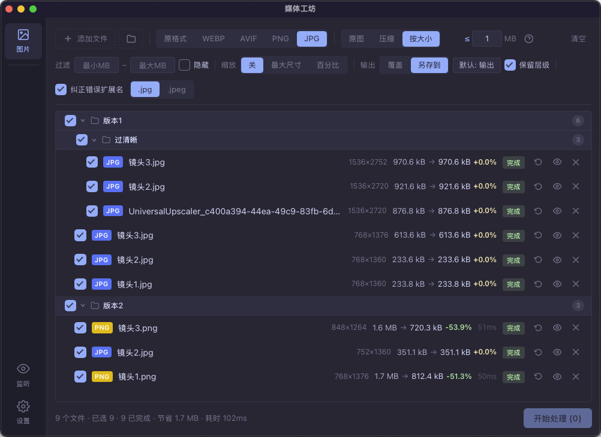
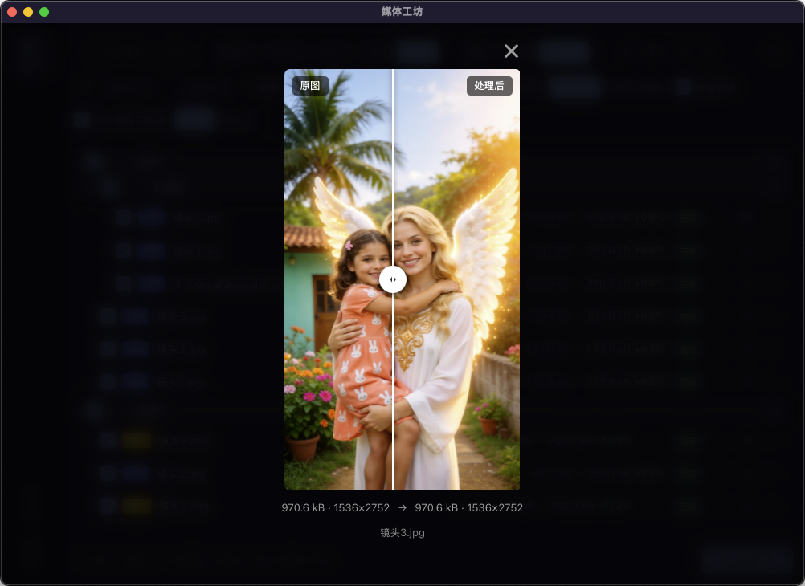

# 🛠 媒体工坊 MediaForge

> 快速、安全、专业的桌面图片压缩工具
> 基于 Rust 构建，所有处理在本地完成，你的图片永远不会离开你的电脑

## 📸 截图预览

| 图片处理 | 压缩对比 |
|:---:|:---:|
|  |  |
| **文件夹监听** | **设置** |
|  |  |

## 🔥 为什么选择媒体工坊

- **极速处理** — Rust 原生编码，单张图片处理仅需 100-200ms，每张图显示实际耗时
- **完全离线** — 不上传、不联网，隐私安全无顾虑
- **轻量安装** — ~10MB 安装包，无需 Python/Node.js 环境，下载即用
- **多线程并发** — 真正利用多核 CPU 同时处理，可配置 1-16 并发
- **文件夹监听** — 设好规则自动处理新文件，全程无需手动操作

## ✨ 核心功能

### 🖼 图片压缩与转换
- 7 种格式互转：JPG、PNG、WebP、AVIF、GIF、BMP、TIFF
- 三种压缩模式：原图 / 压缩（质量滑块）/ 按目标大小
- PNG 专属：100% 无损优化（oxipng），< 100% 有损压缩（imagequant）
- 图片缩放：最大尺寸限制或百分比缩放
- 高性能编码引擎：turbojpeg（SIMD）、libwebp、oxipng

### 📁 智能文件管理
- 拖拽导入文件和文件夹，自动识别目录层级
- 文件夹树形视图，按层级折叠展开
- 批量选择：按文件和按文件夹勾选
- 全屏预览：拖拽分割线对比压缩前后效果

### 👁 文件夹监听
- 多文件夹独立监听，每个文件夹独立启停和配置
- 支持自定义：扩展名过滤、压缩预设、输出格式、输出目录
- 文件写入完成检测，防重复处理
- 处理日志持久化，带时间戳和详情

### 🖥 系统集成
- 系统托盘实时显示监听状态
- 托盘菜单直接启停各文件夹监听
- 自动更新，新版本红点提示
- macOS 毛玻璃 / Windows Mica 原生效果

## 📦 下载

| 平台 | 下载 |
|------|------|
| 🍎 macOS (Apple Silicon) | [GitHub Releases](https://github.com/ninetyeights/media-forge/releases) |
| 🍎 macOS (Intel) | [GitHub Releases](https://github.com/ninetyeights/media-forge/releases) |
| 🪟 Windows (x86_64) | [GitHub Releases](https://github.com/ninetyeights/media-forge/releases) |

## 🏗 技术栈

| 层级 | 技术 |
|------|------|
| 框架 | Tauri 2 |
| 前端 | Svelte 5、TypeScript、Tailwind CSS 4 |
| 后端 | Rust |
| 图片处理 | image、turbojpeg、webp、oxipng、imagequant |
| 文件监听 | notify 7 |

## 🚀 开发

```bash
pnpm install
pnpm tauri dev
```

## 📄 许可证

GPL-3.0
